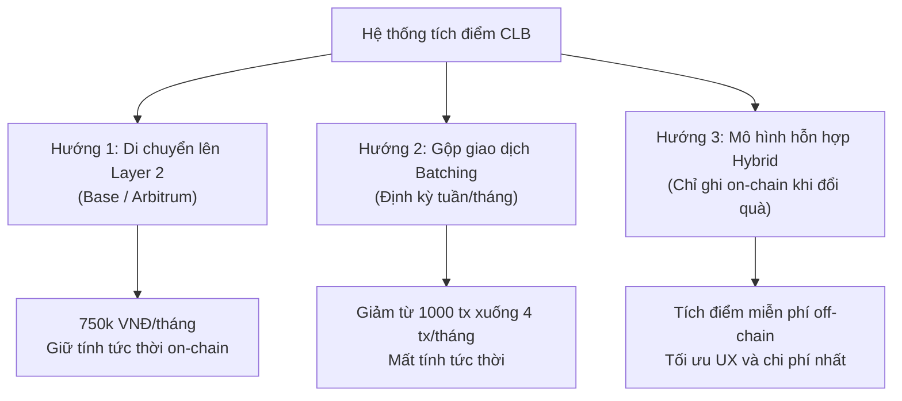

# BÁO CÁO THẨM ĐỊNH KINH TẾ & CHI PHÍ VẬN HÀNH THỰC TẾ (GAS) — LAB 7

* **Học phần:** Tiền điện tử và Hợp đồng thông minh (ECO2432)
* **Giảng viên phụ trách:** TS. Hà Ngọc Long
* **Khoa:** Hệ thống Thông tin Kinh tế — Trường Đại học Kinh tế
* **Sinh viên thực hiện:** Lê Huy
* **Email:** lehuy10012005@gmail.com
* **Địa chỉ ví Sepolia thực nghiệm:** `0xB07FB0761c33a01F7f7493A6a8a9667F4842Fd50`
* **Kho lưu trữ GitHub:** [lehuy10012005-cmd/ECO2432-Lab-2026](https://github.com/lehuy10012005-cmd/ECO2432-Lab-2026)

---

## 1. Bản chất kinh tế của Gas & Khung lý thuyết nền tảng

### 1.1. Gas trên Ethereum là gì dưới góc nhìn kinh tế?
Trong kinh tế học vi mô, tài nguyên tính toán (CPU, bộ nhớ RAM, lưu trữ đĩa SSD) của mạng lưới máy ảo phi tập trung Ethereum Virtual Machine (EVM) là một **nguồn lực khan hiếm** (Scarce Resource). 
- Để ngăn chặn các cuộc tấn công từ chối dịch vụ (DDoS) hoặc vòng lặp vô hạn (Halting Problem), mạng lưới áp dụng cơ chế định giá tài nguyên gọi là **Gas**.
- Mọi chỉ thị bytecode EVM (cộng, trừ, băm SHA-256, đọc/ghi vào bộ nhớ vĩnh viễn `SSTORE`/`SLOAD`) đều được gán một định mức tiêu thụ gas cố định.
- **Gas Fee (Phí giao dịch)** đóng vai trò là chi phí cận biên (Marginal Cost) mà người gửi phải trả để mua quyền được ghi nhận trạng thái vào sổ cái bất biến của toàn nhân loại.

### 1.2. Công thức tính phí nền tảng
Theo chuẩn EIP-1559 và lý thuyết tài chính on-chain:

$$\text{Phí giao dịch (ETH)} = \text{Lượng gas tiêu thụ (Gas Used)} \times \text{Đơn giá Gas (Gas Price tính theo Gwei)} \times 10^{-9}$$

$$\text{Chi phí quy đổi (USD)} = \text{Phí giao dịch (ETH)} \times \text{Giá thị trường của ETH (USD)}$$

$$\text{Chi phí quy đổi (VNĐ)} = \text{Chi phí quy đổi (USD)} \times \text{Tỷ giá USD/VNĐ}$$

*Quy ước đơn vị tiền tệ chuẩn on-chain:*
* $1\text{ ETH} = 10^9\text{ Gwei} = 10^{18}\text{ Wei}$
* $1\text{ Gwei} = 10^{-9}\text{ ETH} = 1.000.000.000\text{ Wei}$

### 1.3. Bảng định mức tiêu hao Gas tham khảo (Benchmark EVM Operations)
*(Theo Phụ lục V, Sổ tay thực hành ECO2432)*

| Loại thao tác trên Blockchain | Lượng Gas ước tính | Mục đích sử dụng điển hình |
| :--- | :--- | :--- |
| **Chuyển ETH thông thường** | `21.000` | Chuyển khoản ví cá nhân P2P |
| **Chuyển token ERC-20 (`transfer`)** | `50.000` – `65.000` | Tích điểm, chuyển token như `ClassPoint.sol` |
| **Ghi biến mới vào Storage (`0` $\rightarrow$ `nonzero`)** | $\approx 20.000$ | Tạo tài khoản mới, cấp hạn mức điểm mới |
| **Cập nhật biến có sẵn (`nonzero` $\rightarrow$ `nonzero`)** | $\approx 5.000$ | Cộng điểm dồn, thay đổi số dư hiện tại |
| **Đọc dữ liệu ngoài chuỗi (hàm `view` / `pure`)** | `0` (Miễn phí) | Tra cứu số dư `balanceOf`, xem tổng cung `totalSupply` |
| **Triển khai hợp đồng thông minh cỡ nhỏ** | `500.000` – `1.500.000` | Đưa hợp đồng `TimeLockVault` hoặc `ClassPoint` lên mạng |

---

## 2. Bài toán: Thẻ tích điểm Câu lạc bộ Sinh viên (Buổi 7)

### 2.1. Đề bài giả định
Một câu lạc bộ sinh viên trường Đại học Kinh tế phát hành token tích điểm `ClassPoint` trên blockchain. 
* **Tần suất hoạt động:** $1.000$ lượt cộng điểm mỗi tháng.
* **Đặc tính kỹ thuật:** Mỗi lượt tích điểm là một giao dịch ghi dữ liệu và chuyển đổi trạng thái số dư on-chain, tiêu thụ ước tính $50.000\text{ gas}$.
* **Tham số thị trường:**
  * Đơn giá gas: $20\text{ Gwei}$.
  * Giá ETH tham chiếu: $3.000\text{ USD/ETH}$ (theo quy định thống nhất của giảng viên).
  * Tỷ giá ngoại hối tham chiếu: $1\text{ USD} = 25.000\text{ VNĐ}$.

---

### 2.2. Câu a: Chi phí vận hành một tháng trên mạng chính Ethereum (Layer 1)

**Bước 1: Tính phí cho 1 giao dịch tích điểm:**
$$\text{Phí 1 giao dịch (ETH)} = 50.000 \times 20 \times 10^{-9} = 0,001\text{ ETH}$$

**Bước 2: Quy đổi sang USD và VNĐ:**
$$\text{Phí 1 giao dịch (USD)} = 0,001 \times 3.000\text{ USD} = 3,00\text{ USD}$$
$$\text{Phí 1 giao dịch (VNĐ)} = 3,00 \times 25.000\text{ VNĐ} = 75.000\text{ VNĐ}$$

**Bước 3: Tổng chi phí vận hành trong 1 tháng (1.000 lượt tích điểm):**
$$\text{Tổng chi phí ETH} = 1.000 \times 0,001\text{ ETH} = 1,00\text{ ETH/tháng}$$
$$\text{Tổng chi phí USD} = 1.000 \times 3,00\text{ USD} = 3.000\text{ USD/tháng}$$
$$\text{Tổng chi phí VNĐ} = 3.000 \times 25.000\text{ VNĐ} \approx \mathbf{75.000.000\text{ VNĐ/tháng}}$$

> **Nhận xét:** Một câu lạc bộ sinh viên phải chi trả **75 triệu đồng mỗi tháng** chỉ riêng tiền phí mạng lưới để duy trì hệ thống tích điểm.

---

### 2.3. Câu b: Chuyển sang mạng Lớp 2 (Layer 2 — Arbitrum / Optimism / Base)

Mạng Lớp 2 sử dụng công nghệ Rollup (nén hàng ngàn giao dịch ngoài chuỗi và chỉ nộp bằng chứng xác thực cùng dữ liệu Calldata/Blob EIP-4844 lên Ethereum L1), do đó đơn giá gas rẻ hơn khoảng **100 lần**.

* **Phí 1 giao dịch trên L2:**
  $$\text{Phí 1 giao dịch L2 (USD)} = \frac{3,00\text{ USD}}{100} = \mathbf{0,03\text{ USD}} \approx \mathbf{750\text{ VNĐ}}$$
* **Tổng chi phí 1 tháng trên L2 (1.000 lượt):**
  $$\text{Tổng chi phí L2 (USD)} = \frac{3.000\text{ USD}}{100} = \mathbf{30\text{ USD/tháng}}$$
  $$\text{Tổng chi phí L2 (VNĐ)} = 30 \times 25.000\text{ VNĐ} \approx \mathbf{750.000\text{ VNĐ/tháng}}$$

---

### 2.4. Câu c: Phân tích kinh tế hành vi & Ai là người gánh chịu chi phí?

| Bên chi trả | Kịch bản trên Mạng chính (Layer 1) | Kịch bản trên Mạng Lớp 2 (Layer 2) |
| :--- | :--- | :--- |
| **Câu lạc bộ chi trả** *(Sponsor Gas)* | **Không khả thi:** $75.000.000\text{ VNĐ/tháng}$ vượt xa toàn bộ ngân sách thường niên của một CLB sinh viên (thường chỉ 5 - 10 triệu/học kỳ). Dự án sẽ dẫn tới vỡ nợ ngay tháng đầu tiên. | **Khả thi:** $750.000\text{ VNĐ/tháng}$ là con số hoàn toàn chấp nhận được, có thể trích từ ngân sách sự kiện hoặc quỹ đối ngoại của CLB. |
| **Sinh viên chi trả** *(User-paid Gas)* | **Hoàn toàn phi lý:** Sinh viên mua ly cà phê căn tin giá $25.000\text{ VNĐ}$, nhưng để được quét mã tích điểm phải trả thêm $75.000\text{ VNĐ}$ tiền gas. Phí giao dịch **gấp 3 lần giá trị hàng hóa** ($\text{Gas-to-Value Ratio} = 300\%$). Sinh viên sẽ lập tức tẩy chay ứng dụng. | **Chấp nhận được:** $750\text{ VNĐ/lần}$ (chiếm $3\%$ giá trị đơn hàng 25k). Tuy nhiên, rào cản UX là sinh viên phải có sẵn ETH trên mạng L2 để trả gas. |

---

### 2.5. Câu d: Kết luận về tính khả thi & 3 Hướng giải pháp kiến trúc kinh tế

**Kết luận đanh thép:** Mô hình tích điểm này **TUYỆT ĐỐI BẤT KHẢ THI** trên mạng chính Ethereum L1. Nếu cố chấp đưa lên L1, sản phẩm sẽ chết yểu vì chi phí giao dịch phá hủy hoàn toàn mô hình kinh doanh.

Để hiện thực hóa ứng dụng, sinh viên Kinh tế đề xuất **3 hướng giải pháp tối ưu hóa kinh tế**:

1. **Hướng 1 — Di chuyển lên mạng Lớp 2 (Layer 2 Migration):**
   * *Cách làm:* Triển khai hợp đồng token lên Base Network hoặc Arbitrum One. CLB sử dụng giải pháp **Account Abstraction (ERC-4337 / Paymaster)** để bảo trợ gas cho sinh viên.
   * *Đánh đổi:* Chi phí $750.000\text{ VNĐ/tháng}$ nằm trong ngân sách; sinh viên trải nghiệm quét mã nhận điểm mượt mà mà không cần nạp tiền vào ví.
2. **Hướng 2 — Gộp giao dịch định kỳ (Batch Settlement):**
   * *Cách làm:* Lưu trữ các lượt tích điểm hàng ngày vào cơ sở dữ liệu ngoài chuỗi (Off-chain Ledger). Mỗi tuần hoặc cuối tháng tổng hợp thành **1 giao dịch duy nhất** ghi số dư lũy kế lên chuỗi.
   * *Đánh đổi:* Số lượng giao dịch giảm từ 1.000 xuống còn 4 giao dịch/tháng. Chi phí trên L1 giảm từ 75 triệu xuống còn $\approx 300.000\text{ VNĐ/tháng}$. Điểm đánh đổi là mất tính xác thực theo thời gian thực (Real-time immutability).
3. **Hướng 3 — Mô hình hỗn hợp Hybrid (Chỉ ghi lên chuỗi khi đổi thưởng):**
   * *Cách làm:* Tích điểm hàng ngày hoàn toàn ngoài chuỗi bằng phần mềm nội bộ (Web2 / Database / Google Sheets). Chỉ khi sinh viên tích lũy đủ mốc đổi quà lớn (ví dụ tích đủ 500 điểm để đổi áo đồng phục hoặc học bổng), hệ thống mới thực hiện 1 giao dịch on-chain để mint NFT chứng nhận hoặc chuyển token thưởng.
   * *Đánh đổi:* Rẻ nhất, thân thiện nhất với người dùng phổ thông, nhưng tính minh bạch trong giai đoạn tích lũy phụ thuộc vào sự liêm chính của ban quản trị CLB.

---

## 3. Mở rộng: Thẩm định chi phí cho Ý tưởng Đồ án Capstone

### 3.1. Đề tài lựa chọn: "Hợp đồng Két tiết kiệm có khóa thời gian sinh viên (Student Timelock Vault)"
* **Mã nguồn thực tế:** [contracts/training/TimeLockVault.sol](file:///c:/Users/ADMIN/Downloads/hce-web3-starter/contracts/training/TimeLockVault.sol)
* **Ý nghĩa tài chính:** Giúp sinh viên rèn luyện kỷ luật tài chính bằng cách khóa tiền tiêu dùng/học phí trong thời hạn 30 đến 90 ngày. Hợp đồng kiên quyết từ chối mọi yêu cầu rút tiền sớm trước hạn qua lỗi `StillLocked(unlockAt, currentTime)`.

### 3.2. Giả định quy mô vận hành
* Số lượng sinh viên tham gia: $100$ sinh viên.
* Số lượt gửi tiết kiệm (`deposit()`): $200$ giao dịch/tháng.
* Số lượt rút khi đáo hạn (`withdraw()`): $50$ giao dịch/tháng.
* Số lượt triển khai hợp đồng (`deployment`): $1$ lần duy nhất.

### 3.3. Bảng đối chiếu chi phí đa mạng lưới (L1 vs L2 vs Testnet)

| Thao tác trên Vault | Lượng Gas đo được (Remix VM) | Chi phí trên Sepolia Testnet | Chi phí trên Ethereum Mainnet (20 Gwei, 3.000 USD/ETH) | Chi phí trên Arbitrum / Base L2 (0,2 Gwei, 3.000 USD/ETH) |
| :--- | :--- | :--- | :--- | :--- |
| **Triển khai hợp đồng** | $\approx 620.000\text{ gas}$ | $0\text{ VNĐ}$ (Fauceted) | $37,20\text{ USD}$ ($\approx 930.000\text{ VNĐ}$) | $0,37\text{ USD}$ ($\approx 9.300\text{ VNĐ}$) |
| **Nạp tiền tiết kiệm (`deposit`)** | $\approx 35.000\text{ gas}$ | $0\text{ VNĐ}$ (Fauceted) | $2,10\text{ USD}$ ($\approx 52.500\text{ VNĐ}$) | $0,021\text{ USD}$ ($\approx 525\text{ VNĐ}$) |
| **Rút tiền đáo hạn (`withdraw`)** | $\approx 38.000\text{ gas}$ | $0\text{ VNĐ}$ (Fauceted) | $2,28\text{ USD}$ ($\approx 57.000\text{ VNĐ}$) | $0,023\text{ USD}$ ($\approx 570\text{ VNĐ}$) |
| **Tổng chi phí vận hành/tháng** *(200 nạp + 50 rút)* | **$8.900.000\text{ gas}$** | **$0\text{ VNĐ}$** | **$534\text{ USD/tháng}$** ($\approx \mathbf{13.350.000\text{ VNĐ}}$) | **$5,34\text{ USD/tháng}$** ($\approx \mathbf{133.500\text{ VNĐ}}$) |

### 3.4. Phân tích kinh tế & Quản trị rủi ro on-chain (Góc nhìn Lê Huy)
1. **Tỷ số Chi phí trên Giá trị (Gas-to-Value Ratio):**
   * Giả sử sinh viên nạp khoản tiền tiết kiệm nhỏ là $200.000\text{ VNĐ}$ vào két.
   * Trên Ethereum Mainnet: Phí nạp là $52.500\text{ VNĐ}$ ($26,25\%$ số tiền gửi). Chưa kể lúc rút lại mất thêm $57.000\text{ VNĐ}$ ($28,5\%$). Tổng chi phí nạp/rút chiếm hơn **$54\%$ số tiền tiết kiệm** $\rightarrow$ Đây là hành vi tự hủy hoại tài chính, hoàn toàn phi kinh tế!
   * Trên Layer 2 (Base/Arbitrum): Phí nạp $525\text{ VNĐ}$ ($0,26\%$), phí rút $570\text{ VNĐ}$ ($0,28\%$). Tổng chi phí chỉ $\approx 0,54\%$, hoàn toàn cạnh tranh với phí chuyển tiền ngân hàng thương mại.
2. **Chiến lược môi trường kiểm thử đồ án:**
   * Trong giai đoạn làm đồ án 3 tuần tại trường, nhóm sử dụng mạng thử nghiệm **Sepolia Testnet** để đảm bảo chi phí bằng $0\text{ VNĐ}$, sinh viên được thao tác ký quỹ và kiểm thử lỗi vô tư mà không rủi ro thất thoát tài sản thật.
   * Khi hoàn thiện bản thương mại hóa (MVP), kiến trúc bắt buộc phải triển khai trên **Layer 2 (Base hoặc Arbitrum One)** để đảm bảo tính bền vững tài chính cho sinh viên.

---

## 4. Kết luận sư phạm quan trọng nhất của Lab 7

> *"Không phải việc gì cũng nên đưa lên blockchain."*  
> — **TS. Hà Ngọc Long** (Sổ tay thực hành ECO2432, Trang 59)

Đây là nguyên lý tối thượng dành cho sinh viên ngành Kinh tế & Fintech:
* Blockchain sinh ra để giải quyết bài toán **niềm tin giữa các bên không quen biết** mà không cần bên thứ ba trung gian thông qua sổ cái phi tập trung bất biến.
* Tuy nhiên, cái giá phải trả cho tính phi tập trung và bất biến đó là **chi phí tính toán đắt đỏ và độ trễ giao dịch**.
* Nếu một bài toán nghiệp vụ (quản lý danh sách thành viên CLB, chấm công, bảng điểm, tích điểm nội bộ đơn giản) có thể giải quyết hiệu quả bằng **bảng tính Excel hoặc hệ cơ sở dữ liệu quan hệ SQL truyền thống**, thì việc cố tình đưa lên blockchain là một quyết định đầu tư lãng phí và phản kinh tế.
* Sinh viên Kinh tế phải luôn tính toán bảng phân tích chi phí - lợi ích (Cost-Benefit Analysis) và xác định rõ **Gas-to-Value Ratio** trước khi gõ bất kỳ một dòng code hợp đồng thông minh nào.

---
*Báo cáo được hoàn thiện theo đúng quy ước [AGENTS.md](file:///c:/Users/ADMIN/Downloads/hce-web3-starter/AGENTS.md) của học phần ECO2432.*
