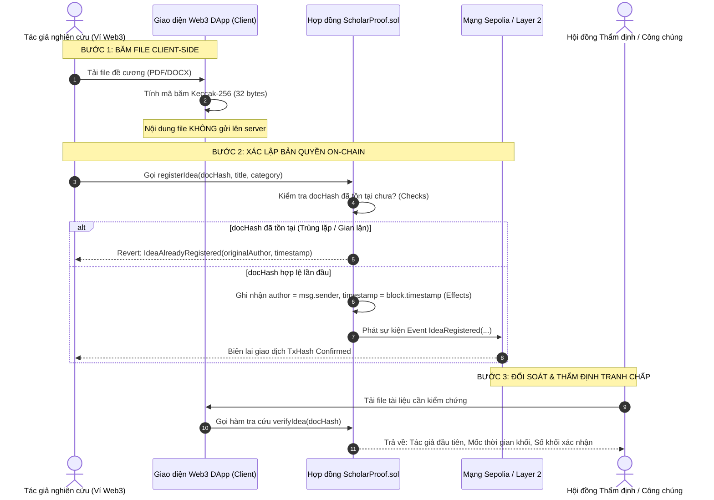

# BÁO CÁO THỰC HÀNH LAB 8: KHỞI ĐỘNG ĐỒ ÁN CAPSTONE — CHỦ ĐỀ 8
## GHI NHẬN QUYỀN TÁC GIẢ CỦA Ý TƯỞNG NGHIÊN CỨU KHOA HỌC (HCE-SCHOLARPROOF)

* **Học phần:** Tiền điện tử và Hợp đồng thông minh (ECO2432)
* **Giảng viên phụ trách:** TS. Hà Ngọc Long
* **Khoa:** Hệ thống Thông tin Kinh tế — Trường Đại học Kinh tế, Đại học Huế
* **Nhóm sinh viên thực hiện:**
  1. **Lê Văn Quang Huy** — MSSV: `23K4300010` (Trưởng nhóm / Kỹ sư Hợp đồng & Đặc tả)
  2. **Lại Vương Gia Bảo** — MSSV: `23K4300024` (Thành viên cặp / Kỹ sư Kiểm thử & Giao diện DApp)
* **Địa chỉ ví Sepolia thử nghiệm:** `0xB07FB0761c33a01F7f7493A6a8a9667F4842Fd50`
* **Kho lưu trữ nhóm (Đồ án Capstone):** [https://github.com/lehuy10012005-cmd/HCE-ScholarProof](https://github.com/lehuy10012005-cmd/HCE-ScholarProof)
* **Kho lưu trữ cá nhân (Lab 1 – 8):** [https://github.com/lehuy10012005-cmd/ECO2432-Lab-2026](https://github.com/lehuy10012005-cmd/ECO2432-Lab-2026)

---

## 1. Bối cảnh nghiên cứu & Nỗi đau thị trường (Problem Statement)

### 1.1. Vấn nạn chiếm đoạt ý tưởng nghiên cứu (Idea Scooping & Plagiarism)
Trong hoạt động nghiên cứu khoa học tại các trường đại học, giai đoạn sơ khởi của một đề tài (hình thành ý tưởng, xây dựng đề cương, phát triển mô hình kinh tế lượng hoặc thu thập bộ dữ liệu độc quyền) là giai đoạn dễ bị tổn thương nhất:
* **Nguy cơ bị "cướp" ý tưởng (Idea Scooping):** Khi sinh viên hoặc giảng viên trình bày ý tưởng tại các buổi seminar, hội đồng xét duyệt đề cương hoặc trao đổi chuyên môn, ý tưởng có thể bị người khác chiếm đoạt và công bố trước mà tác giả thực sự không có cách nào chứng minh mình là người nghĩ ra trước.
* **Thời gian xử lý truyền thống quá chậm:** Quy trình đăng ký quyền sở hữu trí tuệ / bản quyền tác giả tại các cơ quan nhà nước thường mất từ **6 đến 18 tháng** cùng chi phí hành chính tốn kém (vài triệu đồng cho mỗi bộ hồ sơ), hoàn toàn không khả thi cho các đề tài nghiên cứu thường niên của sinh viên hoặc các nghiên cứu vi mô có vòng đời ngắn.
* **Hạn chế của bằng chứng kỹ thuật số Web2:** Lưu trữ bản thảo qua email, Google Drive hoặc sao lưu máy tính cục bộ không đủ độ tin cậy pháp lý cao do mốc thời gian (timestamp) có thể bị thao túng bởi người quản trị máy chủ (Server Admin) hoặc phần mềm chỉnh sửa đồng hồ hệ thống.

### 1.2. Lời giải kinh tế học thể chế & Chi phí giao dịch (Transaction Cost Economics)
Theo lý thuyết Chi phí giao dịch của Ronald Coase, rào cản lớn nhất ngăn cản việc bảo vệ quyền sở hữu trí tuệ vi mô chính là **chi phí xác lập và bảo vệ quyền tài sản** (Enforcement Cost).
* Hợp đồng thông minh trên blockchain cung cấp một cơ chế xác lập quyền ưu tiên (Prior Art) tự động với chi phí cận biên tiệm cận bằng 0.
* Nhóm đề xuất xây dựng giải pháp **HCE-ScholarProof** nhằm cung cấp cho cộng đồng học thuật Trường Đại học Kinh tế một "Sổ cái chứng minh sự tồn tại" (Proof of Existence Ledger) phi tập trung, bất biến và minh bạch tuyệt đối.

---

## 2. Kiến trúc giải pháp: Bằng chứng tồn tại & Ghi dấu thời gian On-chain

### 2.1. Nguyên lý Proof of Existence (Chứng minh sự tồn tại mật mã)
Một sai lầm nghiêm trọng trong thiết kế hệ thống blockchain là cố gắng lưu toàn bộ tệp tài liệu nghiên cứu (file PDF, DOCX vài chục Megabytes) lên Smart Contract. Dưới góc nhìn kế toán chi phí on-chain (đã chứng minh ở Lab 7), ghi 1 MB dữ liệu lên Ethereum Storage có thể tốn hàng trăm ngàn USD phí gas.

Giải pháp tối ưu của HCE-ScholarProof là tách biệt hoàn toàn giữa **Nội dung dữ liệu (Off-chain)** và **Dấu vân tay mật mã (On-chain)**:
1. **Băm ngoài chuỗi (Client-side Hashing):** Tệp nghiên cứu được đưa qua thuật toán băm mật mã chuẩn **Keccak-256 / SHA-256** ngay trên trình duyệt của người dùng. Kết quả thu được là một chuỗi băm cố định 32 bytes (`bytes32 docHash`).
2. **Bảo toàn quyền riêng tư (Zero-knowledge / Privacy-preserving):** Mã băm là hàm một chiều, không ai có thể giải mã ngược lại để xem nội dung công trình. Nhờ đó, nhà nghiên cứu có thể đăng ký bảo hộ ý tưởng mà **không cần công khai nội dung bí mật** trước khi đề tài hoàn thành.
3. **Ghi nhận on-chain (Immutable Timestamping):** Smart Contract chỉ lưu trữ đúng 32 bytes chuỗi băm cùng địa chỉ ví của tác giả (`msg.sender`) và thời gian đóng khối (`block.timestamp`).

### 2.2. Sơ đồ luồng nghiệp vụ hệ thống (Mermaid Workflow)



---

## 3. Thiết kế Hợp đồng thông minh `ScholarProof.sol`

Hợp đồng được thiết kế tuân thủ nghiêm ngặt chuẩn mực của học phần ECO2432 và quy ước [AGENTS.md](file:///c:/Users/ADMIN/Downloads/hce-web3-starter/AGENTS.md):
* **Solidity ^0.8.20**, sử dụng cấu trúc `error` tùy biến để tối ưu hóa gas.
* **Cơ chế Checks-Effects-Interactions (CEI):** Kiểm tra trạng thái tồn tại trước khi cập nhật bộ nhớ Storage.
* **Phát sự kiện (Events):** Mọi thao tác ghi nhận đều phát sự kiện để các công cụ bên ngoài (Indexers / DApp frontend) dễ dàng bắt dữ liệu theo thời gian thực.
* **Chống rủi ro tập trung (Zero Centralization Risk):** Hợp đồng không trao quyền cho Owner sửa đổi tác giả của một ý tưởng đã nộp. Một khi đã ghi nhận, mốc thời gian và danh tính tác giả là **vĩnh viễn bất biến**.

### 3.1. Cấu trúc dữ liệu cốt lõi
```solidity
struct IdeaRecord {
    address author;        // Địa chỉ ví của tác giả sáng lập
    uint256 timestamp;     // Mốc thời gian khối (block.timestamp)
    uint256 blockNumber;   // Thứ tự khối giao dịch xác nhận
    string title;          // Tiêu đề ý tưởng / công trình
    string category;       // Lĩnh vực chuyên môn (Kinh tế số, Tài chính, AI,...)
    bool exists;           // Cờ đánh dấu đã đăng ký
}

// Ánh xạ từ vân tay số docHash sang bản ghi quyền tác giả
mapping(bytes32 => IdeaRecord) private _ideas;
```

### 3.2. Cấu trúc lỗi tùy biến (Custom Errors)
```solidity
error InvalidDocHash();                                      // Băm rỗng (bytes32(0))
error EmptyTitle();                                          // Tiêu đề rỗng
error IdeaAlreadyRegistered(bytes32 docHash, address author, uint256 timestamp); // Trùng lặp
error IdeaNotFound(bytes32 docHash);                         // Ý tưởng chưa đăng ký
```

---

## 4. Kịch bản Kiểm thử nghiêm ngặt (Test Cases)

Theo quy tắc giám sát AI trong [AGENTS.md](file:///c:/Users/ADMIN/Downloads/hce-web3-starter/AGENTS.md), hệ thống bắt buộc phải được thiết kế với tối thiểu 3 ca kiểm thử:

| STT | Tên ca kiểm thử | Điều kiện đầu vào | Thao tác thực hiện | Kết quả mong đợi | Ý nghĩa quản trị rủi ro & Kế toán |
| :---: | :--- | :--- | :--- | :--- | :--- |
| **TC-01** | **Luồng chuẩn (Happy Path)** | Tác giả A (`0xB07F...`) có tệp đề cương nghiên cứu mới, mã băm `0x4a8f...` chưa từng có trên sổ cái. | Gọi `registerIdea(0x4a8f..., "Mo hinh ESG ngan hang", "Tai chinh")`. | Giao dịch thành công, lưu đúng tác giả A, mốc thời gian khối hiện tại, phát sự kiện `IdeaRegistered`. | Xác lập quyền sở hữu trí tuệ hợp pháp đầu tiên cho tác giả gốc. |
| **TC-02** | **Ca gian lận (Fraud / Scooping)** | Kẻ mạo danh B có được tệp đề cương của tác giả A, cố tình nộp cùng mã băm `0x4a8f...` để cướp quyền tác giả. | Kẻ B gọi `registerIdea(0x4a8f..., "De tai danh cap", "Tai chinh")`. | Giao dịch **bị đảo ngược (Revert)** với lỗi `IdeaAlreadyRegistered`, hiển thị ví tác giả A và mốc thời gian trước đó. | Ngăn chặn hành vi đạo văn và cướp công lao nghiên cứu; bảo vệ nguyên tắc ưu tiên thời gian (First-to-File). |
| **TC-03** | **Ca biên ngoại lệ (Boundary Case)** | Người dùng vô tình hoặc cố ý gửi mã băm rỗng `bytes32(0)` hoặc để trống tiêu đề nghiên cứu. | Gọi `registerIdea(bytes32(0), "Tieu de", "Nganh")` hoặc bỏ trống `title = ""`. | Giao dịch **bị từ chối ngay lập tức**, trả về lỗi `InvalidDocHash()` hoặc `EmptyTitle()`. Không tốn phí lưu trữ. | Chống rác bộ nhớ Storage của EVM, đảm bảo tính toàn vẹn của sổ cái. |

---

## 5. Đánh giá Kinh tế & Chi phí Vận hành Gas thực tế

Kế thừa kết quả tính toán chi phí gas từ Lab 7, nhóm thực hiện phân tích hiệu quả tài chính của việc đăng ký quyền tác giả trên blockchain:

| Môi trường triển khai | Định mức Gas tiêu thụ | Đơn giá Gas tham chiếu | Chi phí quy đổi (USD) | Chi phí quy đổi (VNĐ) | Thời gian xác nhận |
| :--- | :---: | :---: | :---: | :---: | :---: |
| **Cơ quan Bản quyền truyền thống** | N/A | Lệ phí nhà nước | $\approx 40 - 100\text{ USD}$ | $1.000.000 - 2.500.000\text{ VNĐ}$ | $6 - 18\text{ tháng}$ |
| **Sepolia Testnet (Môi trường thực hành)** | $\approx 68.000\text{ gas}$ | $2\text{ Gwei}$ | **$0\text{ USD}$** | **$0\text{ VNĐ}$** | $12\text{ giây}$ |
| **Ethereum Mainnet (L1)** *(ETH = $3.000, 20 Gwei)* | $\approx 68.000\text{ gas}$ | $20\text{ Gwei}$ | $4,08\text{ USD}$ | $\approx 102.000\text{ VNĐ}$ | $12\text{ giây}$ |
| **Base / Arbitrum (Layer 2)** *(ETH = $3.000, 0.2 Gwei)* | $\approx 68.000\text{ gas}$ | $0,2\text{ Gwei}$ | **$0,04\text{ USD}$** | **$\approx 1.000\text{ VNĐ}$** | $< 2\text{ giây}$ |

### Nhận định kinh tế của sinh viên:
1. **Hiệu quả chi phí vượt trội:** Trên mạng Lớp 2 (Base/Arbitrum), chi phí để xác lập một bằng chứng bản quyền bất biến chỉ khoảng **$1.000\text{ VNĐ}$** (rẻ hơn 1.000 lần so với nộp đơn truyền thống).
2. **Khả năng tiếp cận bình đẳng (Democratization of IP):** Mọi sinh viên năm nhất, năm hai với một ý tưởng nghiên cứu sơ khai đều có thể tự bảo vệ tài sản trí tuệ của mình mà không bị rào cản tài chính hay thủ tục hành chính cản trở.

---

## 6. Kế hoạch phối hợp thực hiện Đồ án (Roadmap)

Nhóm cam kết lộ trình thực hiện nghiêm túc trong 4 tuần tiếp theo:
* **Tuần 1 (Lab 8 - 9):** Hoàn thiện hồ sơ đăng ký đề tài `TOPIC_REGISTRATION.md`, viết bản đặc tả nghiệp vụ chi tiết `SPEC.md`, thiết lập máy trạng thái quản lý vòng đời ý tưởng.
* **Tuần 2 (Lab 10 - 11):** Lập trình Smart Contract `ScholarProof.sol` chuẩn OpenZeppelin v5, kiểm thử toàn diện trên Remix VM với bộ test suite chống gian lận.
* **Tuần 3 (Lab 12 - 13):** Xây dựng giao diện Web3 DApp bằng HTML/CSS hiện đại kết nối thư viện `Ethers.js v6`, tích hợp hàm băm file client-side và kết nối ví MetaMask.
* **Tuần 4 (Lab 14 - 15):** Triển khai thử nghiệm trên Sepolia Testnet, kiểm toán gas thực tế, xác thực hợp đồng trên Etherscan và bảo vệ đồ án trước TS. Hà Ngọc Long.

---
*Báo cáo được hoàn thiện theo đúng quy chuẩn [AGENTS.md](file:///c:/Users/ADMIN/Downloads/hce-web3-starter/AGENTS.md) của học phần ECO2432.*
